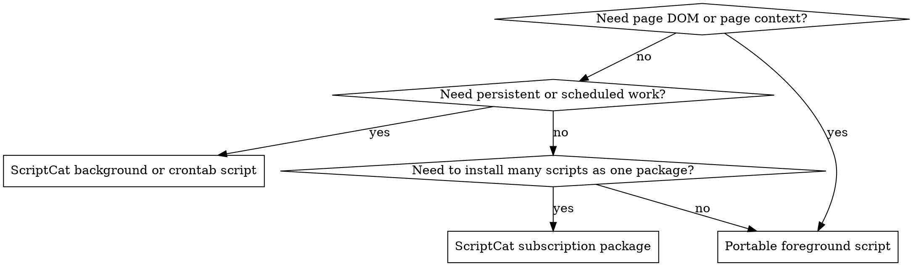

Userscript work usually breaks at the runtime and metadata boundary, not in the page logic. Choose the runtime first, declare the minimum permissions up front, then debug in the environment where the script actually runs.

## When to Use

Use this skill for:

- writing or fixing a Tampermonkey or ScriptCat userscript
- debugging injection timing, missing permissions, CSP workarounds, update checks, or `GM_*` behavior
- deciding between a portable foreground script and ScriptCat-only `@background` or `@crontab`
- adding config UI with `==UserConfig==`
- packaging a ScriptCat `==UserSubscribe==` bundle or preparing a CloudCat-compatible script

Do not use this skill for full browser extension development or general browser automation outside userscript managers.

## Runtime Selection

## Preflight

- Confirm the manager and browser. On Manifest V3 browsers, ScriptCat may require `Allow User Scripts` or browser developer mode before scripts run.
- Decide page script versus background script before writing code. ScriptCat background scripts cannot touch the DOM.
- Start with metadata, not implementation: `@match`, `@grant`, `@connect`, `@run-at`, and any update URLs.
- Prefer portable `==UserScript==` patterns for ordinary page scripts. Only switch to ScriptCat-only headers when the requested behavior actually needs them.

## Workflow

1. Choose the runtime and metadata first.
2. Declare the smallest permission surface that fits the task.
3. Implement against the runtime you chose.
4. Debug where the code really runs.
   - Foreground scripts: page console plus manager logs.
   - ScriptCat background scripts: run log first, then `background.html` for real-environment debugging.
5. Publish with the right update model.
   - Normal scripts: keep `@version` accurate and add `@updateURL` or `@downloadURL` only when needed.
   - Subscription bundles: use `==UserSubscribe==`, HTTPS URLs, and subscription-level `@connect`.

## Quick Reference

| Intent                               | Default choice                               | Watch for                                                                 |
| ------------------------------------ | -------------------------------------------- | ------------------------------------------------------------------------- |
| Page UI, DOM scraping, page patching | Portable `==UserScript==`                    | `@match`, `@grant`, `@run-at`, CSP-sensitive injection                    |
| Cross-origin API access              | `GM_xmlhttpRequest` with explicit `@connect` | Missing hosts, cookie behavior differences, user authorization            |
| Long-running worker                  | ScriptCat `@background`                      | No DOM, must return `Promise` for async work                              |
| Scheduled task                       | ScriptCat `@crontab`                         | Only first `@crontab` counts, prefer 5-field cron, avoid interval overlap |
| User-editable settings               | `==UserConfig==` plus `GM_getValue`          | Block placement and `group.key` naming                                    |
| Silent bundle install and updates    | `==UserSubscribe==`                          | HTTPS, `user.sub.js`, subscription `connect` overrides child scripts      |

## Common Mistakes

- Missing `@grant` for APIs the script actually uses.
- Missing `@connect` for hosts used by `GM_xmlhttpRequest` or `GM_cookie`.
- Treating `@include` as a better default than `@match` for ordinary host targeting.
- Using DOM APIs inside ScriptCat background or cron scripts.
- Returning from a ScriptCat background script before async GM work is truly finished.
- Mixing `==UserScript==` and `==UserSubscribe==` packaging concepts.
- Putting `==UserConfig==` in the wrong place or reading config keys without the `group.key` name.
- Assuming Tampermonkey and ScriptCat storage, notification, or request behavior is identical.

## References

- [`references/metadata-and-api-map.md`](./references/metadata-and-api-map.md)
- [`references/scriptcat-extensions.md`](./references/scriptcat-extensions.md)
